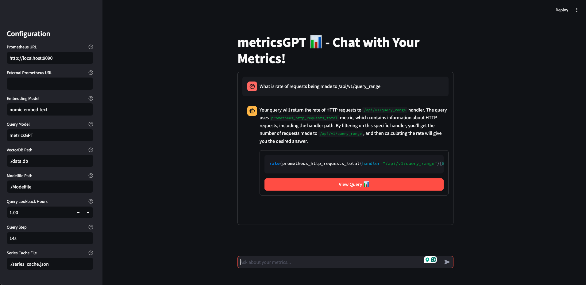

# metricsGPT

Talk to your metrics.



> [!NOTE]
>
> This is a work in progress with no API guarantees. The current implementation needs work on scalability.

## Installation

Ensure you have Python 3.12+ and Node v20+ locally .

By default this tool uses [`llama3`](https://ollama.com/library/llama3) and [`nomic-embed-text`](https://ollama.com/library/nomic-embed-text).

```bash
ollama pull llama3
ollama pull nomic-embed-text
```

After cloning run,
```bash
make venv
source venv/bin/activate
pip3 install -r requirements.txt
```

Have some local prometheus up and running. You can use `make run-prom` to get one running in docker that scrapes itself.

Finally run,
```bash
python3 run metricsGPT.py --server
```
and visit localhost:8081!

## Configuration

Edit [config.yaml](./config.yaml) to suit your own models/Prometheus/Thanos setups.

```yaml
# Prometheus Configuration
prometheus_url: "http://localhost:9090"
# prometheus_auth:
#   # Basic authentication
#   basic_auth:
#     username: "your_username"
#     password: "your_password"
  
#   # Or Bearer token
#   bearer_token: "your_token"
  
#   # Or custom headers
#   custom_headers:
#     Authorization: "Custom your_auth_header"
#     X-Custom-Header: "custom_value"
  
#   # TLS/SSL configuration
#   tls:
#     cert_file: "/path/to/cert.pem"
#     key_file: "/path/to/key.pem"
#     skip_verify: false  # Set to true to skip 

prom_external_url: null  # Optional external URL for links in the UI
query_lookback_hours: 1.0

# Storage Configuration
vectordb_path: "./data.db"
series_cache_file: "./series_cache.json"

# Server Configuration
refresh_interval: 900  # VectorDB Refresh interval in seconds 
server_host: "0.0.0.0"
server_port: 8081

# LLM Configuration
llm:
  provider: "ollama"
  model: "llama3.1"

embedding:
  provider: "ollama"  # or "openai"
  model: "nomic-embed-text"
  dimension: 768 # optional, defaults to this dimension

# For Azure OpenAI embeddings:
#embedding:
#  provider: "azure"
#  model: "text-embedding-ada-002"
#  deployment_name: "your-embedding-deployment"
#  api_key: "your-api-key"
#  endpoint: "your-azure-endpoint"
#  api_version: "2023-05-15"  
#  dimension: "dimensions of model"

# For Watson embeddings:
#embedding:
#  provider: "watsonx"
#  api_key: "your-api-key"
#  project_id: "your-project-id"
#  model_id: "google/flan-ul2"  # optional, defaults to this model
#  dimension: "dimensions of model"

# For OpenAI embeddings:
#embedding:
#  provider: "openai"
#  model: "text-embedding-ada-002"
#  api_key: "your-api-key"
#  dimension: "dimensions of model"

# Example configurations for different providers:

# For OpenAI:
#llm:
#  provider: "openai"
#  model: "gpt-4"
#  api_key: "your-api-key"

# For Ollama:
#llm:
#  provider: "ollama"
#  model: "metricsGPT"
#  timeout: 120.0

# For Azure:
#llm:
#  provider: "azure"
#  model: "gpt-4"
#  deployment_name: "your-deployment"
#  api_key: "your-api-key"
#  endpoint: "your-azure-endpoint"

# For Gemini:
#llm:
#  provider: "gemini"
#  model: "gemini-pro"
#  api_key: "your-api-key"

# For WatsonX:
#llm:
#  provider: "watsonx"
#  api_key: "your-api-key"
#  project_id: "your-project-id"
#  model_id: "your-model-id"
```

## TODOs:
- Much more efficient vectorDB ops
- Use other Prom HTTP APIs for more context
- Range queries
- Visualize
- Embed query results for better analysis
- Process alerts