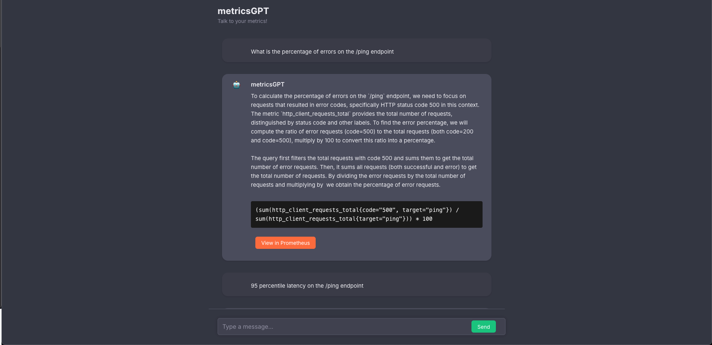

# metricsGPT

Talk to your metrics.



> [!NOTE]
>
> This is a work in progress with no API guarantees. The current implementation needs work on scalability.

## Installation

Ensure you have Python 3.12+ and Node v20+ locally .

By default this tool uses [`llama3`](https://ollama.com/library/llama3) and [`nomic-embed-text`](https://ollama.com/library/nomic-embed-text).

```bash
ollama pull llama3
ollama pull nomic-embed-text
```

After cloning run,
```bash
make venv
source venv/bin/activate
pip3 install -r requirements.txt
```

Have some local/remote prometheus up and running. You can use `make run-prom` to get one running in docker that scrapes itself.

Finally run,
```bash
python3 run metricsGPT.py --server
```
and visit localhost:8081!

Edit [config.yaml](./config.yaml) to suit your own models/Prometheus/Thanos setups.

## TODOs:
- Much more efficient vectorDB ops
- Use other Prom HTTP APIs for more context
- Range queries
- Visualize
- Embed query results for better analysis
- Process alerts